```{r setup, include = FALSE}
# libraries --------------------------------------------------------------------
library(anicon)
library(countdown)
library(fontawesome)
library(knitr)
library(DT)
library(tidyverse)

# functions --------------------------------------------------------------------
include_img <- function(img_name) {
  paste0("https://raw.githubusercontent.com/damien-dupre/img/main/", img_name) |> 
  knitr::include_graphics()
}

headerCallback <- c(
  "function(thead, data, start, end, display){",
  "  $('th', thead).css('border-bottom', '5px solid black');",
  "}"
)

overview_table <- function(x) {
  x |> 
    datatable(
      rownames = FALSE,
      extensions = 'Responsive',
      options = list(
        headerCallback = JS(headerCallback),
        dom = 't',
        pageLength = -1,
        ordering = FALSE,
        columnDefs = list(
          list(className = 'dt-center', targets = 0),
          list(width = '300px', targets = 0)
          )
      ),
      # class = 'cell-border stripe',
      escape = FALSE
    ) |> 
    formatStyle(c('Variable', 'Notes'), fontSize = '70%')
}

# data -------------------------------------------------------------------------
sass_variables <- read.csv("https://raw.githubusercontent.com/damien-dupre/BAA1028/refs/heads/main/data/sass_variables.csv")

```

## Overview

HTML documents rendered with Quarto use Bootstrap 5 by default. This can be disabled or customized via the `theme` option:

```{.yaml filename="_quarto.yml" code-line-numbers=false}
theme: default # bootstrap 5 default
theme: cosmo   # cosmo bootswatch theme
theme: pandoc  # pandoc default html treatment
theme: none    # no theme css added to document
```

## Overview

Quarto includes 25 themes from the [Bootswatch](https://bootswatch.com/) project. Available themes include:

> default, cerulean, cosmo, cyborg, darkly, flatly, journal, litera, lumen, lux, materia, minty, morph, pulse, quartz, sandstone, simplex, sketchy, slate, solar, spacelab, superhero, united, vapor, yeti, zephyr

Use of any of these themes via the `theme` option. For example:

```{.yaml filename="_quarto.yml" code-line-numbers=false}
format:
  html:
    theme: united
```

You can also customize these themes or create your own new themes.

## Basic Options

If you are using a Bootstrap theme, there are a set of options you can provide in document metadata to customize its appearance. These include: 

> max-width, mainfont, fontsize, fontcolor, linkcolor, monofont, monobackgroundcolor, linestretch, backgroundcolor, margin-left, margin-right, margin-top, margin-bottom

See for details: [HTML Themes Basic Options](https://quarto.org/docs/output-formats/html-themes.html#basic-options)

## Basic Options

For example. here we set the font-size a bit larger and specify that we want a bit more space between lines of text:

``` yaml
format:
  html: 
    theme: cosmo
    fontsize: 1.1em
    linestretch: 1.7
```

## Dark Mode

In addition to providing a single theme for your html output, you may also provide a light and dark theme. For example:

``` yaml
format:
  theme:
    light: flatly
    dark: darkly
```

When providing both a dark and light mode for your html output, Quarto will automatically create a toggle to allow your reader to select the desired dark or light appearance.

## Dark Mode

Setting the above themes in your `_quarto.yml` results in both a dark and light version of your output being available. For example:

:::: {layout="[1,1]"}
::: {#first-column}
##### Flatly Themed Output

{fig-alt="A screenshot of the header of the light version of this page showcasing the Flatly theme."}
:::

::: {#second-column}
##### Darkly Themed Output

{fig-alt="A screenshot of the header of the dark version of this page showcasing the Darkly theme."}
:::
::::

## Theme Options

You can do extensive customization of themes using [Sass](https://sass-lang.com/). Bootstrap defines over 1,400 Sass variables that control fonts, colors, padding, borders, and much more. You can see all of the variables here:

<https://github.com/twbs/bootstrap/blob/main/scss/_variables.scss>

Sass theme files can define both variables that globally set things like colors and fonts, as well as rules that define more fine grained behavior. 

To customize an existing Bootstrap theme with your own set of variables and/or rules, just provide the base theme and then your custom theme file(s):

``` yaml
format:
  theme:
    - cosmo
    - custom.scss
```

<!-- ## Theme Options -->

<!-- Your `custom.scss` file might look something like this: -->

<!-- ``` css -->
<!-- /*-- scss:defaults --*/ -->
<!-- $h2-font-size:          1.6rem !default; -->
<!-- $headings-font-weight:  500 !default; -->

<!-- /*-- scss:rules --*/ -->
<!-- h1, h2, h3, h4, h5, h6 { -->
<!--   text-shadow: -1px -1px 0 rgba(0, 0, 0, .3); -->
<!-- } -->
<!-- ``` -->

<!-- Note that the variables section is denoted by the `/*-- scss:defaults --*/` comment and the rules section (where normal CSS rules go) is denoted by the `/*-- scss:rules --*/` comment. -->

##  Your Turn {background="#43464B"}

Have a look at the different themes from the [Bootswatch](https://bootswatch.com/) project.

Add at least 1 theme to your website. You can also choose a light and dark theme:

:::: {layout="[1,1]"}
::: {#first-column}
```{.yaml filename="_quarto.yml" code-line-numbers=false}
format:
  html:
    theme: united
```
:::

::: {#second-column}
```{.yaml filename="_quarto.yml" code-line-numbers=false}
format:
  theme:
    light: flatly
    dark: darkly
```
:::
::::

```{r}
countdown(minutes = 3, warn_when = 60)
```

# Use Sass

## What is Sass?

:::: {layout="[1,1]"}
::: {#first-column}

```{r}
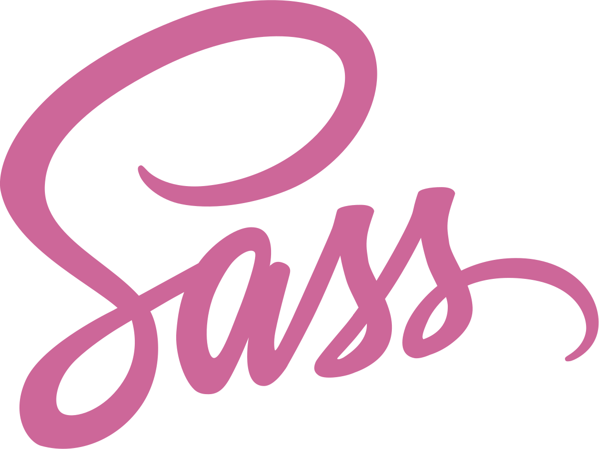
```

[**S**yntactically **A**wesome **S**tyle**s**heets](https://sass-lang.com/)
:::

::: {#second-column}
- Sass is a **CSS extension** (provides additional features, like variables)
- Sass is a **CSS preprocesser** (converts Sass code into standard CSS, which is a critical step because browsers can’t interpret Sass and can interpret CSS)
:::

::::

## Sass Reduces Repetition

Sass extends existing CSS features in a number of exciting ways, but importantly **reduces repetition**. 

For example, let’s say you’re building a website / web page that uses three colors:

```{r}
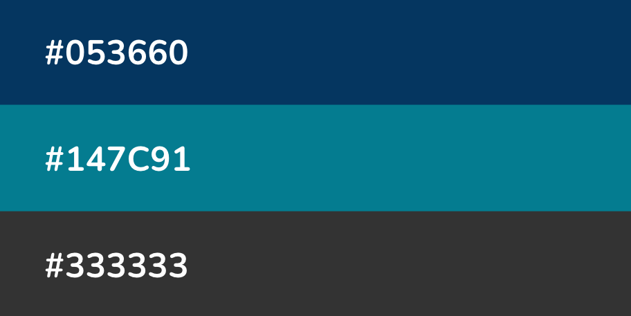
```

You might imagine how often you'll need to type those HEX codes out as you developing your stylesheet...it can get annoying rather quickly.

## Sass Reduces Repetition

Or just look at my website:

```{.scss filename="Example stylesheet (.scss)"}
/*-- scss:defaults --*/

// Headings
$headings-color: #E84E0F !default;

// Text colour
$body-color: #2A2E46 !default;
$body-bg: #eeeeee !default;

// Navbar
$navbar-bg: #2A2E46  !default;
$navbar-fg: #eeeeee !default;

// hover on navbar
.navbar-expand-lg .navbar-nav .nav-link:hover {
  color: #E84E0F;
}
.navbar-expand-lg .navbar-nav .nav-link.active {
  color: #eeeeee;
}
```

## Define Sass Variables {.smaller}

Sass allows us to **define variables** (in the form `$var-name: value;`) for our colors, which we can reference instead of writing out their HEX codes each time. This makes your stylesheet **more readable and easier to update** (e.g. only need to update HEX codes in one spot, not multiple!).

```{.sass filename="Example stylesheet (.scss)"}
/*-- scss:defaults --*/

// define Sass vars 
$darkblue: #053660;
$teal: #147C91;
$darkgray: #333333;

// use vars in CSS rules (we'll learn more about how to write CSS soon!) 
h1 {
  font-color: $darkblue;
}

.button-styling {
  background: $teal;
  color: $darkblue; 
  border-color: $darkgray;
}
```

**Note:** Sass has two syntaxes – SCSS syntax (`.scss`), shown above, is the most common. It stands for **S**assy **C**ascading **S**tyle**s**heets and also the SASS syntax (`.sass`)

## Quarto compiles Sass automatically

Web browsers can interpret CSS ([]{.teal-text} `.css`) but not Sass ([]{.teal-text} `.scss` or `.sass`). 

. . . 

Typically, you’d need to **compile (i.e. convert) Sass to CSS**, then link the resulting `.css` file in your HTML.

. . . 


Lucky for us, **Quarto compiles the contents of a `.scss` file into CSS without any extra steps** -- all we need to do is link to a `.scss` file directly in our website's `_quarto.yml`. 

## Create .scss File

1. Create a `.scss` file in your repo's root directory using the Terminal:

:::: {layout="[1,1,1]"}
::: {#first-column}
```{.bash filename="Bash or zsh"}
touch styles.scss
```
:::

::: {#second-column}
```{.bash filename="CMD"}
type nul > styles.scss
```
:::

::: {#third-column}
```{.bash filename="PowerShell"}
ni styles.scss
```
:::
::::

2. Add the `/*-- scss:defaults --*/` region decorator to the top of `styles.scss` ([required by Quarto](https://quarto.org/docs/output-formats/html-themes-more.html)) -- you'll write all your Sass variables underneath this.

```{.sass filename="styles.scss"}
/*-- scss:defaults --*/
```

Adding the region decorator as written above is ***critical!*** Quarto won't recognize your `.scss` file without it.

## Create .scss File

3. Apply your `styles.scss` file to your website using the `theme` option: 

```{yaml filename="_quarto.yml"}
#| eval: false
#| echo: true
#| code-line-numbers: "3"

format:
  html:
    theme: 
      - cosmo
      - styles.scss
    toc: true
    page-layout: full
```

Note: I've also removed the `css: styles.css` option that was included by default, since I'll be writing all my sass and css in this single styles.scss file

## Define colors variables

4. I like to start by defining the colors I want to use throughout my site. For example:

```{sass filename="styles.scss"}
#| eval: false
#| echo: true
#| code-line-numbers: "3-9"
/*-- scss:defaults --*/

// Colors
$dark-green: #858E79;
$light-green: #D1D9CE;
$cream: #FDFBF7;
$gray: #64605f;
$purple: #9158A2;
$orange: #ad7237;
```

You can also define values with units, e.g. `$my-font-size: 25px;`.

**Note:** In `.scss` files, `//` denote single line comments. Multi-line comments start with `/*` and end at the next `*/`.

## Define Quarto Sass variables

5. Quarto provides a [list of pre-defined Sass Variables](https://quarto.org/docs/output-formats/html-themes.html#sass-variables), which control the appearance of various website elements and that can be specified within `.scss` files. We can **assign our newly-minted color variables *as values* to Quarto Sass variables** to easily update things like the background color, navbar & footer colors, hyperlink color, and more.

```{r}

```

## Define Quarto Sass variable {.smaller}

Use the syntax `$quarto-var: $your-color-var;`.

```{sass filename="styles.scss"}
#| eval: false
#| echo: true
#| code-line-numbers: "11-25"
/*-- scss:defaults --*/

// Colors
$dark-green: #858E79;
$light-green: #D1D9CE;
$cream: #FDFBF7;
$gray: #64605f;
$purple: #9158A2;
$orange: #ad7237;

// Base document colors
$navbar-bg: $cream; // navbar
$navbar-fg: $dark-green; // navbar foreground elements
$navbar-hl: $purple; // highlight color when hovering over navbar links
$body-bg: $light-green; // page background 
$body-color: $gray; // page text 
$footer-bg: $cream; // footer 
$link-color: $purple; // hyperlinks 

// Inline code
$code-bg: $cream; // inline code background color
$code-color: $purple; // inline code text color
```

## Sass Variables

The following Sass Variables can be specified within SCSS files (note that these variables should always be prefixed with a `$` and are specified within theme files rather than within YAML options)

## Colors

```{r}
sass_variables |> 
  filter(Object == "Colors") |> 
  select(-Object) |> 
  overview_table()
```

## Fonts

```{r}
sass_variables |> 
  filter(Object == "Fonts") |> 
  select(-Object) |> 
  overview_table()
```

## Code Blocks

```{r}
sass_variables |> 
  filter(Object == "Code Blocks") |> 
  select(-Object) |> 
  overview_table()
```

## Code Annotation

You can customize the colors used to highlight lines when [code annotation](https://quarto.org/docs/authoring/code-annotation.qmd) is used:

+-----------------------------------+---------------------------------------------------------------------------+
| Variable                          | Notes                                                                     |
+===================================+===========================================================================+
| `$code-annotation-higlight-color` | The color used as a border on highlighted lines.                          |
+-----------------------------------+---------------------------------------------------------------------------+
| `$code-annotation-higlight-bg`    | The color used for the background of highlighted lines.                   |
+-----------------------------------+---------------------------------------------------------------------------+

## Code Copy

You can also customize the colors of the button which appears for `code-copy: true` with the following variables:

+-------------------------------+---------------------------------------------------------------------------+
| Variable                      | Notes                                                                     |
+===============================+===========================================================================+
| `$btn-code-copy-color`        | The color used for the copy button at the top right of code blocks.       |
+-------------------------------+---------------------------------------------------------------------------+
| `$btn-code-copy-color-active` | The hover color used for the copy button at the top right of code blocks. |
+-------------------------------+---------------------------------------------------------------------------+

## Inline Code

+---------------+-------------------------------------------------------------------------------------------------+
| Variable      | Notes                                                                                           |
+===============+=================================================================================================+
| `$code-bg`    | The background color of inline code. Defaults to a mix between the `body-bg` and `body-color`.  |
+---------------+-------------------------------------------------------------------------------------------------+
| `$code-color` | The text color of inline code. Defaults to a generated contrasting color against the `code-bg`. |
+---------------+-------------------------------------------------------------------------------------------------+

## Table of Contents

+-----------------------------------+------------------------------------------------------------------------+
| Variable                          | Notes                                                                  |
+===================================+========================================================================+
| `$toc-color`                      | The color for table of contents text.                                  |
+-----------------------------------+------------------------------------------------------------------------+
| `$toc-font-size`                  | The font-size for table of contents text.                              |
+-----------------------------------+------------------------------------------------------------------------+
| `$toc-active-border`              | The left border color for the currently active table of contents item. |
+-----------------------------------+------------------------------------------------------------------------+
| `$toc-inactive-border`            | The left border colors for inactive table of contents items.           |
+-----------------------------------+------------------------------------------------------------------------+

## Layout

+------------------------+---------------------------------------------------------------------------------------------------+
| Variable               | Notes                                                                                             |
+========================+===================================================================================================+
| `$content-padding-top` | Padding that should appear before the main content area (including the sidebar, content, and TOC. |
+------------------------+---------------------------------------------------------------------------------------------------+

## Navigation

+---------------+-----------------------------------------------------------------------------------------------------------------------------------------------------------------------------+
| Variable      | Notes                                                                                                                                                                       |
+===============+=============================================================================================================================================================================+
| `$navbar-bg`  | The background color of the navbar. Defaults to the theme's `$primary` color.                                                                                               |
+---------------+-----------------------------------------------------------------------------------------------------------------------------------------------------------------------------+
| `$navbar-fg`  | The color of foreground elements (text and navigation) on the navbar. If not specified, a contrasting color is automatically computed.                                      |
+---------------+-----------------------------------------------------------------------------------------------------------------------------------------------------------------------------+
| `$navbar-hl`  | The highlight color for links in the navbar. If not specified, the `$link-color` is used or a contrasting color is automatically computed.                                  |
+---------------+-----------------------------------------------------------------------------------------------------------------------------------------------------------------------------+

## Navigation

+---------------+-----------------------------------------------------------------------------------------------------------------------------------------------------------------------------+
| Variable      | Notes                                                                                                                                                                       |
+===============+=============================================================================================================================================================================+
| `$sidebar-bg` | The background color for a sidebar. Defaults to `$light` except when a navbar is present or when the style is `floating`. In that case it defaults to the `$body-bg` color. |
+---------------+-----------------------------------------------------------------------------------------------------------------------------------------------------------------------------+
| `$sidebar-fg` | The color of foreground elements (text and navigation) on the sidebar. If not specified, a contrasting color is automatically computed.                                     |
+---------------+-----------------------------------------------------------------------------------------------------------------------------------------------------------------------------+
| `$sidebar-hl` | The highlight color for links in the sidebar. If not specified, the `$link-color` is used.                                                                                  |
+---------------+-----------------------------------------------------------------------------------------------------------------------------------------------------------------------------+

## Navigation

+---------------+-----------------------------------------------------------------------------------------------------------------------------------------------------------------------------+
| Variable      | Notes                                                                                                                                                                       |
+===============+=============================================================================================================================================================================+
| `$footer-bg`  | The background color for the footer. Defaults to the `$body-bg` color.                                                                                                      |
+---------------+-----------------------------------------------------------------------------------------------------------------------------------------------------------------------------+
| `$footer-fg`  | The color of foreground elements (text and navigation) on the footer. If not specified, a contrasting color is automatically computed.                                      |
+---------------+-----------------------------------------------------------------------------------------------------------------------------------------------------------------------------+


## Callouts

+--------------------------+--------------------------------------------------------------------------------------------------------------------------------------------------------------------+
| Variable                 | Notes                                                                                                                                                              |
+==========================+====================================================================================================================================================================+
| `$callout-border-width`  | The left border width of callouts. Defaults to `5px`.                                                                                                              |
+--------------------------+--------------------------------------------------------------------------------------------------------------------------------------------------------------------+
| `$callout-border-scale`  | The border color of callouts computed by shifting the callout color by this amount. Defaults to `0%`.                                                              |
+--------------------------+--------------------------------------------------------------------------------------------------------------------------------------------------------------------+
| `$callout-icon-scale`    | The color of the callout icon computed by shifting the callout color by this amount. Defaults to `10%`.                                                            |
+--------------------------+--------------------------------------------------------------------------------------------------------------------------------------------------------------------+

## Callouts

+--------------------------+--------------------------------------------------------------------------------------------------------------------------------------------------------------------+
| Variable                 | Notes                                                                                                                                                              |
+==========================+====================================================================================================================================================================+
| `$callout-margin-top`    | The amount of top margin on the callout. Defaults to `1.25rem`.                                                                                                    |
+--------------------------+--------------------------------------------------------------------------------------------------------------------------------------------------------------------+
| `$callout-margin-bottom` | The amount of bottom margin on the callout. Defaults to `1.25rem`.                                                                                                 |
+--------------------------+--------------------------------------------------------------------------------------------------------------------------------------------------------------------+


## Bootstrap Variables

In addition to the above Sass variables, Bootstrap itself supports hundreds of additional variables. You can [learn more about Bootstrap's use of Sass variables](https://getbootstrap.com/docs/5.1/customize/sass/) or review the [raw variables and their default values](https://github.com/twbs/bootstrap/blob/main/scss/_variables.scss).

## Combining themes {.smaller}

You also do not need to create a theme entirely from scratch! If you like parts of a pre-built [Bootswatch theme](https://bootswatch.com/), you can modify it by layering on your desired updates using your own custom `styles.scss` file. 

For example, let's say I love everything about the pre-built [cosmo](https://bootswatch.com/cosmo/) theme, and only want to update the navbar background color to orange. My files might look something like this:  

:::: {layout="[1,1]"}
::: {#first-column}

```{.r filename="_quarto.yml"}
format:
  html:
    theme: 
      - cosmo
      - styles.scss
    toc: false
    page-layout: full
```

```{.sass filename="styles.scss"}
/*-- scss:defaults --*/

$orange: #ad7237;
$navbar-bg: $orange;
```
:::

::: {#second-column}
```{r}
#| eval: true
#| echo: false
#| out-width: "100%"
#| fig-align: "center"

```
:::
::::

Our resulting website, which is primarily themed using `cosmo`, but with a custom orange navbar.

##  Your Turn {background="#43464B"}

1. Create a `.scss` file in your repo's root directory using the Terminal:

:::: {layout="[1,1,1]"}
::: {#first-column}
```{.bash filename="Bash or zsh"}
touch styles.scss
```
:::

::: {#second-column}
```{.bash filename="CMD"}
type nul > styles.scss
```
:::

::: {#third-column}
```{.bash filename="PowerShell"}
ni styles.scss
```
:::
::::

2. Add the `/*-- scss:defaults --*/` decorator to the top of `styles.scss`;

3. Apply the path to your `styles.scss` file using the `theme` option with your theme;

4. In your `styles.scss` file, define 3 colours and assign them to the variables:

  - `$navbar-bg:`
  - `$navbar-fg:`
  - `$body-bg:`

```{r}
countdown(minutes = 10, warn_when = 60)
```

## Explore Google Fonts

Fonts are just as important as colour in expressing yourself and your brand. You should absolutely be importing and using a different (more exciting) font family(ies) than the default.

Browse the many available Google fonts at <https://fonts.google.com/> and choose 2 fonts. Click on the **Filters** button in the top left corner of the page to help narrow your choices.

They can easily be applied by following these 3 steps

```{r}

```

## Select Fonts {.smaller}

1. Select a Google font family by clicking the blue **Get Font** button in the top right corner of the page, which adds your font family to your “bag.” You can add as many font families to your bag as you’d like to import -- here, we select both [Nunito](https://fonts.google.com/specimen/Nunito?query=nunito) and [Sen](https://fonts.google.com/specimen/Sen?query=sen).

:::: {layout="[1,1]"}
::: {#first-column}
Explore the [Nunito font family](https://fonts.google.com/specimen/Nunito), which is available in a number of styles (i.e. different weights and italic):
```{r}

```
:::

::: {#second-column}
View all of your selected font families and get your embed code from your shopping bag:
```{r}
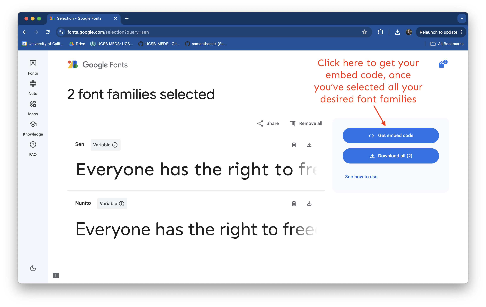
```
:::
::::

## Select Fonts

2. Click **Get embed code**, then choose the **@import** radio button (beneath the **Web** menu option), which will provide your import code chunk. Copy everything between the `<style> </style>` tags (starting with `@import` and ending with `;`) to your clipboard.

```{r}
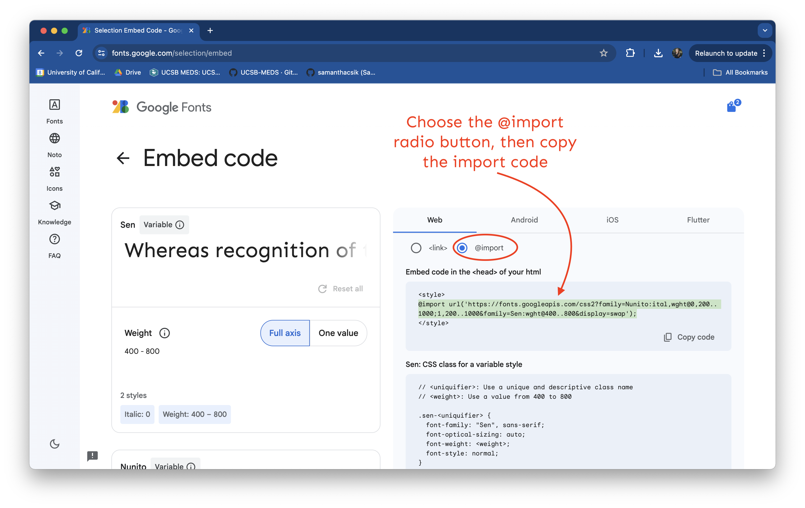
```

## Select Fonts

3. Paste the import code into `styles.scss` (I always place this at the top of my stylesheet, beneath `/*-- scss:defaults --*/`).

```{r}
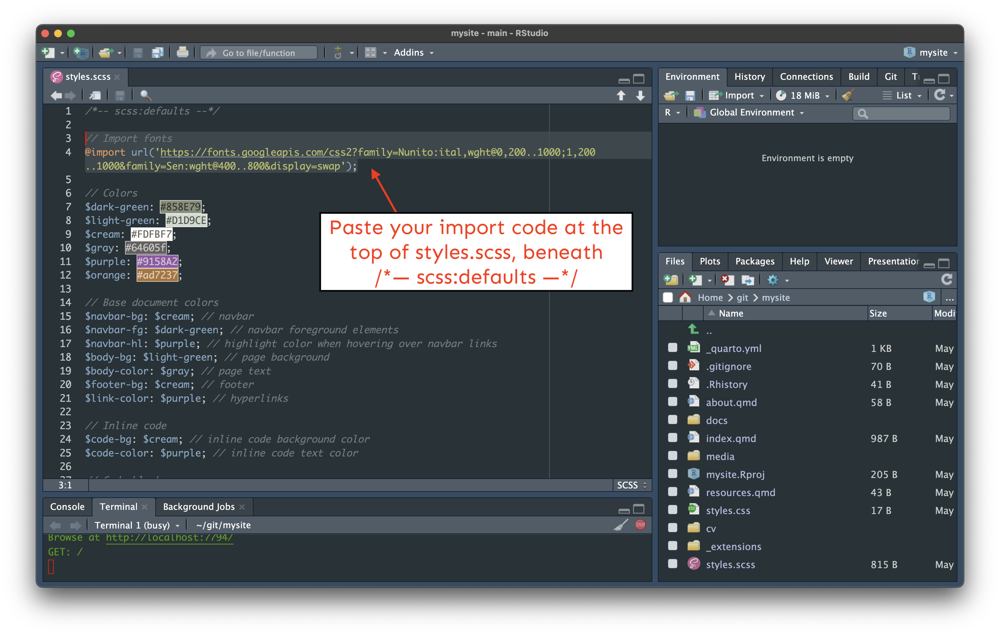
```

## Select Fonts (gif)

If you're like me, you might find a gif of the whole process helpful:

```{r}
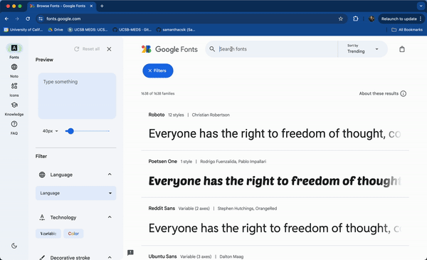
```

## Import fonts {.smaller}
 
Your `styles.scss` should now similar to this:

```{sass filename="styles.scss"}
#| eval: false
#| echo: true
#| code-line-numbers: "3-4"
/*-- scss:defaults --*/

// Import Google fonts
@import url('https://fonts.googleapis.com/css2?family=Nunito:ital,wght@0,200..1000;1,200..1000&family=Sen:wght@400..800&display=swap');

// Colors
$dark-green: #858E79;
$light-green: #D1D9CE;
$cream: #FDFBF7;
$gray: #64605f;
$purple: #9158A2;
$orange: #ad7237;

// Base document colors
$navbar-bg: $cream; // navbar
$navbar-fg: $dark-green; // navbar foreground elements
$navbar-hl: $purple; // highlight color when hovering over navbar links
$body-bg: $light-green; // page background 
$body-color: $gray; // page text 
$footer-bg: $cream; // footer 
$link-color: $purple; // hyperlinks 

// Inline code
$code-bg: $cream; // inline code background color
$code-color: $purple; // inline code text color

// Code blocks
$code-block-bg: $cream; // code block background color 
```

## Set mainfont {.smaller}

The easiest way to apply a main (i.e. default) font for all text elements on your website is in `_quarto.yml` using the `mainfont` option: 
 
:::: {layout="[1,1]"}
::: {#first-column}

```{.yaml filename="_quarto.yml"}
format:
  html:
    theme: 
     - cosmo
     - styles.scss
    mainfont: Nunito
    toc: true
    page-layout: full
```
:::

::: {#second-column}

```{r}

```
:::
::::

All text elements on our website are now Nunito

## Apply other fonts?

Cool, but what about applying our second font, Sen?

Great question, and hang tight! This requires some CSS, which is the perfect segue into our next section.

## Apply other fonts?

**** If you plan to use multiple fonts, you can create Sass variables for each font type, then use those variables as you construct your CSS rules. For example, this slide deck uses three fonts (Sanchez, Montserrat, and Roboto Mono):

```{css}
#| eval: false
#| echo: true
// Import fonts
@import url('https://fonts.googleapis.com/css2?family=Lato&family=Montserrat&family=Nunito+Sans:wght@200&family=Roboto+Mono:wght@300&family=Sanchez&display=swap');

// Fonts
$font-family-serif: 'Sanchez', serif;
$font-family-sans-serif: 'Montserrat', sans-serif;
$font-family-monospace: 'Roboto Mono', monospace;
```

**** You must import a higher font weight (e.g. 800), in addition to your standard "regular" weight, if you wish to **bold** text -- even bolding text using markdown syntax (e.g. `**this text is bold**`) will not work unless a higher font weight style is imported).

##  Your Turn {background="#43464B"}

1. Select the Montserrat Google font family from <https://fonts.google.com>;

2. Click **Get embed code**, then choose the **@import** radio button and copy everything between the `<style> </style>` tags;

3. Paste the import code into `styles.scss` 

4. Apply it as a main font for all text elements on your website is in `_quarto.yml` using the `mainfont` option.

```{r}
countdown(minutes = 5, warn_when = 60)
```

# CSS + Quarto

## Quarto comes with `styles.css`

A `styles.css` file is automatically generated when you create a Quarto site.

**We can write our CSS rules in `styles.css`, but alternatively, we can write them directly in our `styles.scss` file** (remember, you can write CSS in a `.scss` file but you can't write Sass in a `.css` file). 

```{r}
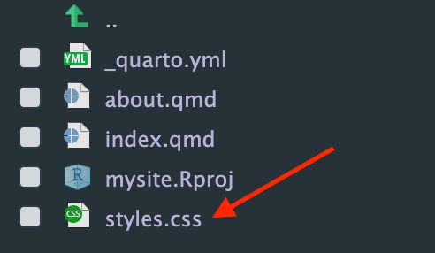
```

You can delete `styles.css` if you don't plan to use it, or leave it be (it won't impact your Quarto site since it's not linked as our stylesheet in `_quarto.yml`).

## SCSS Rules Divider

To start defining CSS rules in `styles.scss` you first need to add the `/*-- scss:rules --*/` region decorator beneath your Sass variables section (**this is important! your CSS won't be recognized without this region decorator in place**):

```{sass filename="styles.scss"}
#| eval: false
#| echo: true
#| code-line-numbers: "11"

/*-- scss:defaults --*/

// Import fonts
@import url('https://fonts.googleapis.com/css2?family=Nunito:ital,wght@0,200..1000;1,200..1000&family=Sen:wght@400..800&display=swap');

// Colors
$dark-green: #858E79;

// additional Sass variables omitted for brevity ~

/*-- scss:rules --*/
```

Next, we'll walk through some examples of how to modify your site with your own CSS rules.

## Write a `<h1>` and `<h2>` grouping selector

```{.sass filename="styles.scss"}
/*-- scss:rules --*/

h1, h2 {
  letter-spacing: 5px;
  font-weight: 800; // Google fonts tells you which weights your chosen font family allows for!
}
```

**Note:** We don't need to make any changes to the HTML (in `about.qmd` and `resources.qmd`) since this grouping selector targets all `<h1>` and `<h2>` elements across the site. If an element on any of the pages has either of those tags, it will get styled according to the declaration(s) included in our CSS rule.

## Preview grouping selector

Our updated `<h1>` and `<h2>` elements should now look something like this:

:::: {.columns}
::: {.column width="47%"}

```{r}
#| out-width: "80%" 
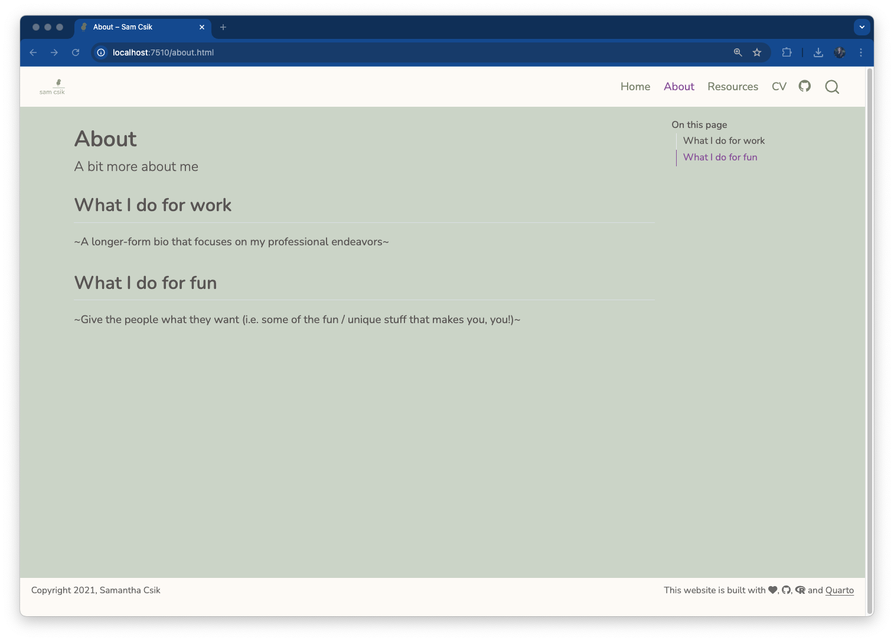
```

No CSS styling on `h1` and `h2` headers

:::
::: {.column width="47%"}

```{r}
#| out-width: "80%" 
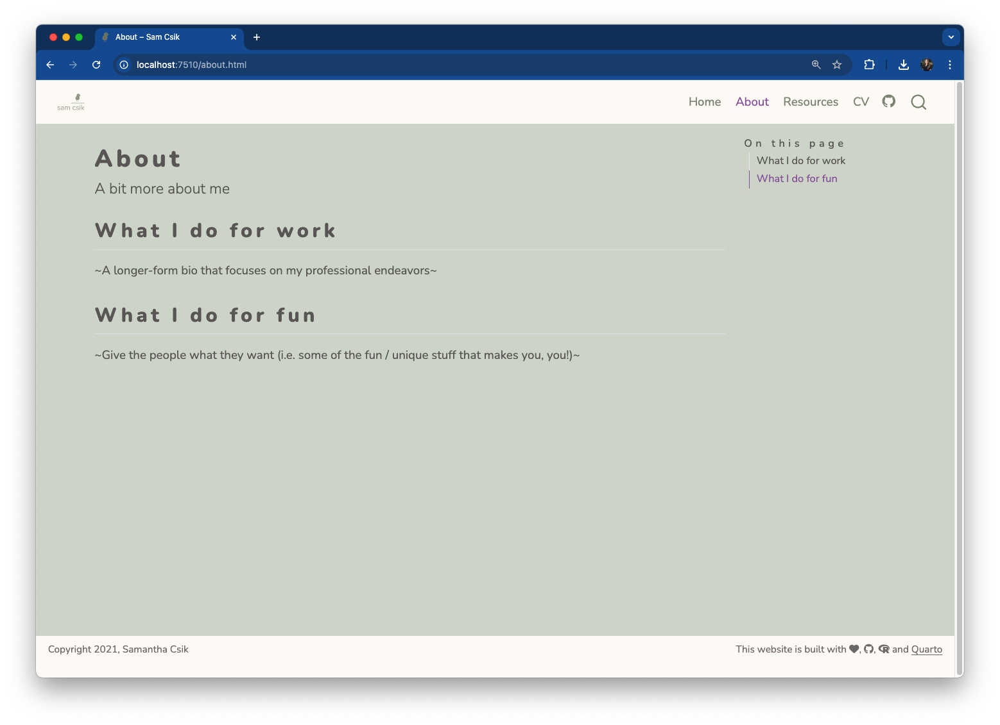
```

With CSS styling on `h1` and `h2` headers

:::
::::

## Predefined 'title' class

All `<h1>` elements are also given the class, `title` (e.g. `<h1> class="title">All of my favorite resources!</h1>`). This means that the Quarto framework has already defined a class selector called `.title` and applied that class to the above elements.

## Predefined 'title' class

```{r}
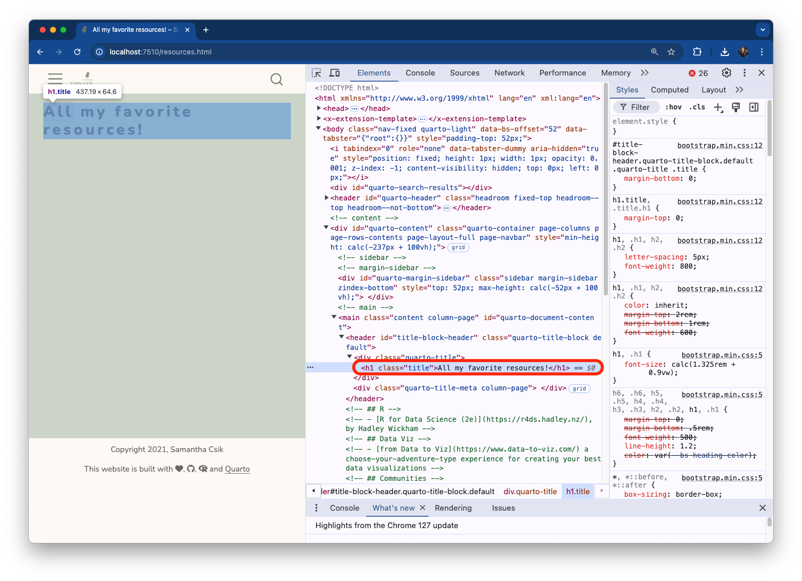
```

## Modify 'title' class

We can modify existing class (or ID) selectors

For example, let's make any text elements that are assigned the class, `.title`, the color maroon:

```{.sass filename="styles.scss"}
/*-- scss:rules --*/

h1, h2 {
  letter-spacing: 5px;
  font-weight: 800; 
}

.title {
  color: maroon;
}
```

## Maroon titles

Check out your new maroon `title`s.

```{r}

```

Similarly, you can modify the `.anchored` class that we saw was, by default, applied to our `<h2>` elements.

## Write your own class selectors

Let's first create two different classes: one to center text on the page, and another to color text orange:

```{.sass filename="styles.scss"}
/*-- scss:rules --*/

h1, h2 {
  letter-spacing: 5px;
  font-weight: 800;
}

.title {
  color: maroon;
}

.center-text {
  text-align: center;
}

.orange-text {
  color: $orange;
}
```

## Write your own class selectors {.smaller}

These styles can be applied as follow:

```{.qmd filename="resources.qmd"}
---
title: "All my favorite resources!"
---
  
<h1>this is an `<h1>` element</h1> 

<h1 class="title">this is an `<h1>` element of class `title`</h1>

<p>this is a `<p>` element</p>

<p class="title">this is a `<p>` element of class `title`</p>
  
--- # three dashes is markdown syntax for creating a horizontal line across your page

<p class="orange-text">This paragraph is orange.</p>
  
<p class="center-text">This paragraph is centered.</p>
  
<p>This paragraph has no styling.</p>

<h2 class="center-text">This level-2 header is centered</h2>
```

## Oranged / centered text

```{r}
#| eval: true 
#| echo: false
#| fig-align: "center"
#| out-width: "60%" 
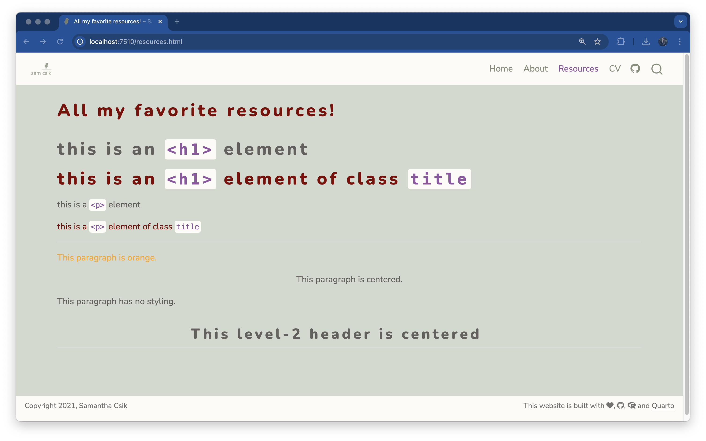
```

## Quarto Syntax

[Quarto also provides its [own syntax](https://quarto.org/docs/authoring/markdown-basics.html#divs-and-spans) for applying classes to elements]{.slide-title3}

You can create both **divs (block-level regions of content)** and **spans (inline content)** using Quarto's syntax. For example:

:::: {.columns}
::: {.column width="47%"}

**Divs**

```{.md}
# Quarto syntax
::: {.my-selector}
Some element (e.g. text) to style
:::
  
# HTML syntax
<div class="my-selector">
  Some element (e.g. text) to style
</div>
```
:::
::: {.column width="47%"}

**Spans**

```{.md}
# Quarto syntax
Some text with just [this section]{.my-
selector} styled

# HTML syntax
<p>Some text with just <span class="my-
selector">this section</span> styled</p>
```
:::
::::

## Mix & match styles

You can mix and match syntaxes in `.qmd` files

An example:

```{.qmd filename="resources.qmd"}
---
title: "All my favorite resources!"
---

<p class="orange-text">Here is some orange text.</p>

<p>And here is some normal text beneath it.</p>

[Here is more orange text written using Quarto's syntax]{.orange-text}
```

## Resize logo

Let's add a CSS rule to increase the size of our logo. Be sure to add this rule beneath your `/*-- scss:rules --*/` region decorator, and note that you may need to adjust the `max-height` value to best suit your own personal logo:

```{.sass}
.navbar-brand img { 
  max-height: 40px;
  width: auto;
}
```

```{r}

```

## References

Huge thanks the following people who have generated and shared most of the content of this lecture:

- Sam Csik: [Customizing Quarto Websites, Make your website stand out using SASS and CSS](https://ucsb-meds.github.io/customizing-quarto-websites)

<br>

```{r}
#| fig-align: "center"
include_graphics("https://media2.giphy.com/media/v1.Y2lkPTc5MGI3NjExdGdyMnhseGczY3NheHU1cHhtdGRzdWRxaXJ1Z3BsdWF6MWdwZm84ZyZlcD12MV9pbnRlcm5hbF9naWZfYnlfaWQmY3Q9Zw/3ohs7JG6cq7EWesFcQ/giphy.gif")
```

## {background="#43464B"}

```{css, echo = FALSE}
img.circle {border-radius:50%;}
```

::: {layout-ncol="2"}


**Thanks for your attention and don't hesitate to ask if you have any questions!**  
[`r fa(name = "mastodon")` @damien_dupre](https://datasci.social/@damien_dupre)  
[`r fa(name = "github")` @damien-dupre](https://github.com/damien-dupre)  
[`r fa(name = "link")` https://damien-dupre.github.io](https://damien-dupre.github.io)  
[`r fa(name = "paper-plane")` damien.dupre@dcu.ie](mailto:damien.dupre@dcu.ie)
:::
